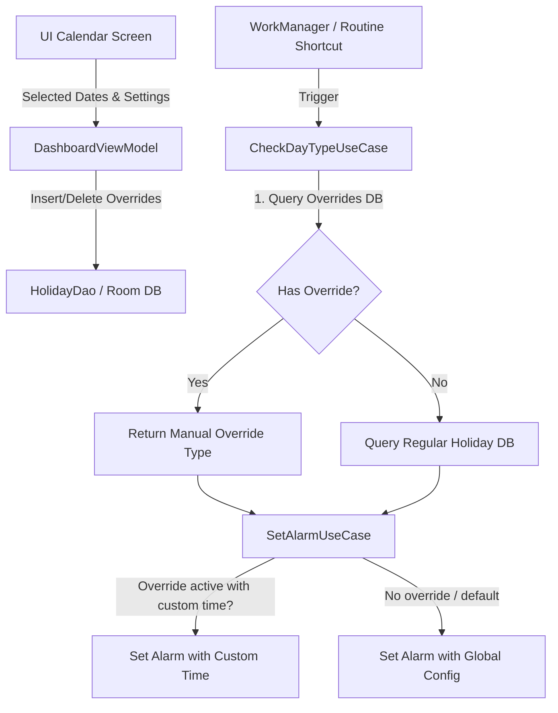

# 自定义日期覆盖 (Date Override) 与批量设置功能设计

本项目在 `v1.2.0` 版本中引入了**自定义日期覆盖 (Date Override)** 功能。这一设计旨在于解决用户在临时休假、调休、出差等特定日期下，需要手动打破法定节假日判定逻辑、强制设闹钟或强制忽略闹钟的痛点诉求。

---

## 1. 核心诉求与业务场景

- **场景 A（强制休假）**：用户在法定工作日（如普通的周二）临时请假一天。此时，虽然按法定规则明天是工作日，但用户希望插件**不要**在这个特定的周二晚上为周三设置闹钟。
- **场景 B（强制加班）**：用户在公司内部安排的周末加班，虽然这并不是法定调休的工作日，但用户需要在特定的周六早上被闹钟唤醒，且希望设置一个**特定于这一天的闹钟时间**（例如，平时 08:30 闹钟，但加班这天改在 09:00 闹钟）。
- **场景 C（批量操作）**：假期出游时，用户希望可以在日历中一次性多选整整一周的日期，一键设置为“强制忽略闹钟”，而不需要一个个点击。

---

## 2. 系统架构与数据存储设计

为了不破坏应用原本高可用、离线优先的本地架构，本功能基于 Room 数据库平滑演进。

### 2.1 数据库持久化层 (Room)
在数据库中新增 `OverrideEntity`，用于持久化保存手动覆盖的日期与具体的参数配置：
- **表名**：`date_overrides`
- **主键**：`date` (`String`, 格式为 `yyyy-MM-dd`)
- **字段**：
  - `date`: `String` (主键)
  - `overrideType`: `String` (可选值: `FORCE_WORK` 表示强班, `FORCE_OFF` 表示强休)
  - `customHour`: `Int?` (当为强班时，允许自定义闹钟的小时)
  - `customMinute`: `Int?` (当为强班时，允许自定义闹钟的分钟)

### 2.2 数据库平滑迁移 (Version 1 -> 2)
为了防止用户在升级 App 时丢失原有的节假日缓存数据，我们编写了平滑迁移逻辑：
- 在 `AppDatabase.kt` 中，将 `@Database(version = 2)` 声明提升，并添加了 `MIGRATION_1_2` 迁移路径（通过 `database.execSQL` 建立 `date_overrides` 表）。
- 在依赖注入模块 `DatabaseModule.kt` 中添加了 `.addMigrations(AppDatabase.MIGRATION_1_2)` 支持。

---

## 3. 拦截器逻辑设计

当三星的“日常程序”触发快捷入口时，系统的后台业务处理流如下：

### 3.1 属性判定拦截 (`CheckDayTypeUseCase`)
在判断今天/明天是“工作日”还是“休息日”时，`CheckDayTypeUseCase` 进行了两层判定：
1. **第一优先级（手动覆盖判定）**：从 Room 中查询目标日期的 `OverrideEntity`。如果存在覆盖配置，则直接返回手动设置的类型：
   - `FORCE_WORK` -> 判定为工作日 (Workday)。
   - `FORCE_OFF` -> 判定为休息日 (Holiday)。
2. **第二优先级（法定节假日判定）**：若在手动覆盖表中无记录，则回退到原有的 `holiday_dates` 数据表，按照国家法定假日规则和周末规则判定。

### 3.2 闹钟时间应用拦截 (`SetAlarmUseCase`)
在设置闹钟阶段，`SetAlarmUseCase` 会读取判定日期的 `OverrideEntity`：
- 若该日期属于“强班 (`FORCE_WORK`)”且其 `customHour` 与 `customMinute` 不为空，系统将**拦截并忽略 DataStore 中的全局闹钟时间配置**，直接采用这一天专属的自定义闹钟时间（如 09:00）。
- 若没有自定义时间，则回退使用 DataStore 中的全局设置。

---

## 4. UI 交互与视觉设计 (Material 3 & You)

UI 设计严格贯彻了 `GEMINI.md` 的色彩规范与极简美学：

- **日历多选与状态可视化**：
  - 点击日历上的日期可以进入“多选模式”。被选中的日期将带有一个精致的 `MaterialTheme.colorScheme.primary` 主色圆角边框。
  - 拥有手动覆盖标记的日期，会在其右上角显示微小的角标指示：**"强班"** 或 **"强休"**。
  - 为了增加视觉层次，指示框和日历组件的卡片使用了富有活力和呼吸感的 **莫兰迪/马卡龙色彩** (`secondaryContainer` 与 `primaryContainer`)，坚决杜绝生硬暗沉的灰色。
- **批量控制底部抽屉 (BottomSheet)**：
  - 当有日期被选中时，底部会缓缓升起 Material 3 的 `ModalBottomSheet` 抽屉。
  - 抽屉清晰地列出了当前选中的日期列表。
  - 提供了三个大卡片式按钮：**【强制设为加班】**、**【强制设为休息】**、**【清除手动设置】**。
- **时间选择对话框 (TimePickerDialog)**：
  - 点击“强制加班”时，用户可自主勾选“设置这一天专用的闹钟时间”。
  - 勾选后，会唤起优雅的 Material 3 官方 `TimePicker` 结合 `TimePickerDialog`，提供纯原生的滑动手势和数字输入盘，操作流畅，完美贴合 Android 14+ 系统的视觉特征。

---

## 5. 零打扰与透明执行原则

- 所有通过覆盖设置触发的系统级闹钟添加，保持**静默原则**。
- 在后台 `ShortcutActivity` 执行后，会在屏幕底部弹出一个**纯文本 Toast**，格式极简无花哨符号（例如：`明天是强制加班日，已设置 09:00 的闹钟` 或 `明天是强制休息日，已忽略闹钟设置`），执行完毕后 Activity 瞬间 `finish()`，对用户的视觉打扰完全为零。
